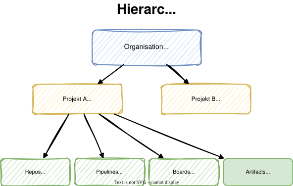

# Modul 01

## Einführung in Azure DevOps

---

## Lernziele

Nach diesem Modul kannst du:

- **Azure DevOps und seine 5 Dienste beschreiben** - Die zentrale Plattform
  mit Boards, Repos, Pipelines, Test Plans und Artifacts kennen
- **Organisation und Projektstruktur verstehen** - Den hierarchischen Aufbau
  von Organisation, Projekt und deren Bestandteilen erklären
- **Azure CLI mit der DevOps-Extension nutzen** - Organisationen, Projekte
  und Repositories per Kommandozeile verwalten

---

## 1. Was ist Azure DevOps?

Azure DevOps ist die **zentrale Plattform von Microsoft** für
Software-Entwicklungsteams. Sie vereint fünf integrierte Dienste:

- **Azure Boards** - Projektmanagement mit Work Items, Sprints und Kanban
- **Azure Repos** - Git-Repositories für Versionskontrolle
- **Azure Pipelines** - CI/CD-Pipelines für Build und Deployment
- **Azure Test Plans** - Manuelles und automatisiertes Testmanagement
- **Azure Artifacts** - Paketverwaltung (NuGet, npm, Maven, Python)

> **Kernidee:** Alle Werkzeuge für den gesamten Software-Lebenszyklus
> an einem Ort - von der Planung bis zum Deployment.

---


---

## 2. Organisation und Projektstruktur

Azure DevOps folgt einer klaren **Hierarchie**:

- **Organisation** - Der oberste Container (z.B. `dev.azure.com/meine-org`)
  - Verwaltet Benutzer, Berechtigungen und Abrechnungen
  - Kann mehrere Projekte enthalten
- **Projekt** - Bündelt zusammengehörige Ressourcen
  - Enthält Repos, Pipelines, Boards und Artifacts
  - Hat eigene Sichtbarkeit (Public/Private)

---



---

## 3. Azure CLI und DevOps Extension

Die **Azure CLI** ermöglicht die Verwaltung von Azure DevOps
per Kommandozeile:

- `az devops` - Organisationen und Projekte verwalten
- `az repos` - Repositories erstellen und konfigurieren
- `az pipelines` - Pipelines erstellen und ausführen
- `az boards` - Work Items verwalten
- `az artifacts` - Paket-Feeds verwalten

```bash
# DevOps-Extension installieren
az extension add --name azure-devops --yes
```

---

## 3.1 CLI-Konfiguration

<style scoped>
section {
    font-size: 1.5rem;
}
</style>

Bevor man die CLI nutzt, konfiguriert man Standardwerte:

```bash
# Subscription setzen
az account set \
  --subscription "30b490cd-637c-4934-87a7-a38eba455adf"

# Standard-Organisation und -Projekt konfigurieren
az devops configure --defaults \
  organization=https://dev.azure.com/pipeline-training-<kürzel> \
  project=pipeline-labs
```

Danach entfällt die Angabe von `--organization` und `--project` bei jedem Befehl.

---

## 3.2 CLI-Beispiele

<style scoped>
section {
    font-size: 1.5rem;
}
</style>

**Projekt anzeigen:**

```bash
az devops project show --project pipeline-labs --output table
```

**Repository erstellen und klonen:**

```bash
# Repository erstellen
az repos create --name "hello-pipeline" --output table

# Repository klonen
git clone https://dev.azure.com/pipeline-training-<kürzel>\
/pipeline-labs/_git/hello-pipeline
```

**Repositories auflisten:**

```bash
az repos list --output table
```

---

## 4. Service Connections

<style scoped>
section {
    font-size: 1.6rem;
}
</style>

**Service Connections** verbinden Azure DevOps mit externen Diensten:

- **Azure Resource Manager** - Zugriff auf Azure-Ressourcen (VMs, App Services, AKS)
- **Docker Registry** - Push/Pull von Container-Images
- **Kubernetes** - Deployment auf K8s-Cluster
- **GitHub / Generic Git** - Zugriff auf externe Repositories

> Connections werden auf **Projekt-Ebene** verwaltet und können in Pipelines referenziert werden.

**Wichtig:** Für CI/CD-Pipelines benötigen wir in späteren Labs eine Service Connection zu Azure (Azure Resource Manager).

---

## Labs

- **Lab 01:** Azure DevOps Organisation und Projekt anlegen
