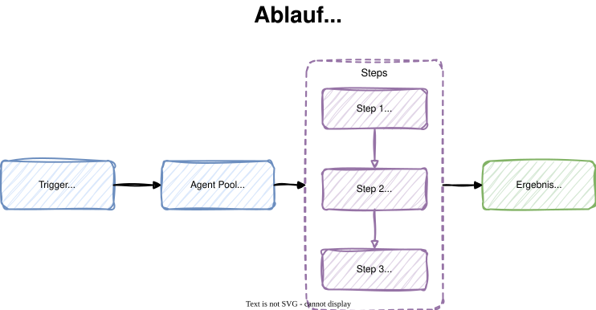
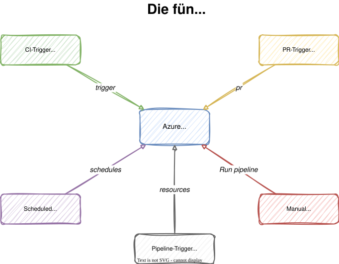

# Modul 02

## Pipeline-Grundlagen

---

## Lernziele

Nach diesem Modul kannst du:

- **Eine YAML-Pipeline erstellen und verstehen** - Den grundlegenden
  Aufbau mit Trigger, Pool und Steps erklären und anwenden
- **Verschiedene Trigger-Arten konfigurieren** - CI-, PR-, Schedule-
  und Pipeline-Trigger gezielt einsetzen
- **Branch- und Path-Filter nutzen** - Builds nur bei relevanten
  Änderungen auslösen und Build-Minuten sparen

---

## 1. Pipeline as Code

Azure Pipelines definiert CI/CD-Workflows als **YAML-Dateien** im
Repository:

- Die Datei `azure-pipelines.yml` liegt im **Root** des Repos
- Sie wird **versioniert** wie jeder andere Code
- Änderungen an der Pipeline durchlaufen denselben
  **Review-Prozess** (Pull Requests)
- Jeder Branch kann eine **eigene Pipeline-Konfiguration** haben

> **Vorteil:** Die gesamte Build-Logik ist nachvollziehbar,
> reproduzierbar und im Team teilbar.

---

## 1.1 Anatomie einer Pipeline

Die einfachste Pipeline besteht aus drei Elementen:

```yaml
# 1. Trigger: Wann soll die Pipeline starten?
trigger:
  - main

# 2. Pool: Wo soll die Pipeline laufen?
pool:
  vmImage: 'ubuntu-latest'

# 3. Steps: Was soll die Pipeline tun?
steps:
  - script: echo "Hallo aus Azure Pipelines!"
    displayName: 'Begrüßung'
```

---



---

<style scoped>
section { font-size: 1.25rem; }
</style>

## 1.2 Vollständiges Pipeline-Beispiel

```yaml
trigger:
  branches:
    include:
      - main

pool:
  vmImage: 'ubuntu-latest'

steps:
  - script: echo "Hallo aus Azure Pipelines!"
    displayName: 'Begrüßung'

  - script: |
      echo "Build-Nummer: $(Build.BuildNumber)"
      echo "Repository: $(Build.Repository.Name)"
      echo "Branch: $(Build.SourceBranchName)"
    displayName: 'Build-Informationen anzeigen'

  - script: |
      echo "Betriebssystem:"
      uname -a
    displayName: 'Agent-Umgebung prüfen'
```

---

## 2. Agent Pools

Ein **Agent** ist die Maschine, auf der die Pipeline-Steps
ausgeführt werden.

<style scoped>
table { font-size: 0.75rem; }
</style>

| Aspekt          | Microsoft-hosted                        | Self-hosted                     |
|:----------------|:----------------------------------------|:--------------------------------|
| Verwaltung      | Von Microsoft bereitgestellt            | Eigene Server/VMs               |
| Setup           | Kein Setup nötig                        | Agent manuell installieren      |
| Verfügbarkeit   | Immer frisch, sauber                    | Persistenter Zustand möglich    |
| Software        | Vordefinierte Images                    | Frei konfigurierbar             |
| Kosten          | Begrenzte kostenlose Minuten            | Eigene Infrastrukturkosten      |
| Netzwerk        | Öffentliches Internet                   | Zugriff auf internes Netz       |

---

## 2.1 Microsoft-hosted Agent Images

Die wichtigsten vorkonfigurierten Images:

- **`ubuntu-latest`** - Linux (Ubuntu), am häufigsten verwendet
- **`windows-latest`** - Windows Server
- **`macos-latest`** - macOS

```yaml
pool:
  vmImage: 'ubuntu-latest'
```

> **Tipp:** `ubuntu-latest` hat die kürzesten Startzeiten und
> die meisten vorinstallierten Tools (Node.js, Python, .NET, Java).

---

## 2.2 Tasks vs. Scripts

<style scoped>
section {
    font-size: 1.5rem;
}
</style>

Es gibt zwei Wege, Aktionen in einer Pipeline auszuführen:

**Scripts** - Direkte Shell-Befehle:

```yaml
- script: echo "Direkter Befehl"
  displayName: 'Shell-Befehl'
```

**Tasks** - Vorgefertigte, wiederverwendbare Bausteine:

```yaml
- task: UseDotNet@2
  inputs:
    packageType: 'sdk'
    version: '8.x'
```

> **Faustregel:** Tasks für komplexe Aktionen (Deployment, Tooling),
> Scripts für einfache Befehle.

---

## 3. Trigger-Typen

Trigger bestimmen, **wann** eine Pipeline automatisch gestartet wird.
Azure Pipelines kennt fünf Trigger-Arten:

1. **CI-Trigger** (`trigger`) - Reagiert auf Pushes
2. **PR-Trigger** (`pr`) - Reagiert auf Pull Requests
3. **Scheduled Trigger** (`schedules`) - Zeitgesteuert per Cron
4. **Manual Trigger** - Manueller Start über die UI oder CLI
5. **Pipeline Trigger** (`resources`) - Startet nach anderer Pipeline

---



---

## 3.1 CI-Trigger (Push)

Der CI-Trigger startet die Pipeline bei einem **Push** auf bestimmte
Branches:

```yaml
trigger:
  branches:
    include:
      - main
      - release/*
    exclude:
      - feature/experimental-*
```

- **`include`** - Nur diese Branches lösen einen Build aus
- **`exclude`** - Diese Branches werden ignoriert
- Wildcards (`*`, `**`) sind möglich

---

## 3.2 Branch-Filter und Path-Filter

<style scoped>
section {
    font-size: 1.4rem;
}
</style>

Path-Filter schränken den Trigger auf bestimmte **Dateipfade** ein:

```yaml
trigger:
  branches:
    include:
      - main
  paths:
    include:
      - src/*
      - azure-pipelines.yml
    exclude:
      - '*.md'
      - docs/*
```

- Änderungen **nur** an Markdown-Dateien lösen **keinen** Build aus
- Änderungen unter `src/` oder an der Pipeline-Datei **schon**

> **Vorteil:** Spart Build-Minuten, da irrelevante Änderungen
> (Dokumentation, README) keinen Build auslösen.

---

## 3.3 PR-Trigger

Der PR-Trigger startet die Pipeline, wenn ein **Pull Request**
gegen bestimmte Branches erstellt oder aktualisiert wird:

```yaml
pr:
  branches:
    include:
      - main
  paths:
    exclude:
      - '*.md'
```

- Validiert Code **vor dem Merge**
- Unterstützt ebenfalls Branch- und Path-Filter
- Kann als **Branch Policy** erzwungen werden

---

<style scoped>
section {
    font-size: 1.4rem;
}
</style>

## 3.4 Scheduled Triggers

Zeitgesteuerte Pipelines nutzen die **Cron-Syntax**:

```yaml
schedules:
  - cron: '0 6 * * Mon-Fri'
    displayName: 'Werktags um 06:00 UTC'
    branches:
      include:
        - main
    always: false
```

**Cron-Format:** `Minute Stunde Tag Monat Wochentag`

| Feld       | Beispiel  | Bedeutung                      |
|:-----------|:----------|:-------------------------------|
| `0 6`      | Minute, Stunde | Um 06:00 Uhr (UTC)       |
| `* *`      | Tag, Monat | Jeden Tag, jeden Monat        |
| `Mon-Fri`  | Wochentag | Montag bis Freitag             |

---

## 3.5 always: true vs. false

<style scoped>
section {
    font-size: 1.6rem;
}
</style>

Der Parameter `always` steuert, ob der Schedule-Build auch
**ohne Code-Änderungen** läuft:

| Wert    | Verhalten                                          |
|:--------|:---------------------------------------------------|
| `false` | Nur ausführen, wenn es Änderungen seit dem letzten Build gab |
| `true`  | Immer ausführen, auch ohne Änderungen               |

---

<style scoped>
section {
    font-size: 1.4rem;
}
</style>

## 3.6 Pipeline Triggers (Resources)

Eine Pipeline kann automatisch starten, wenn eine **andere Pipeline**
erfolgreich abgeschlossen wird:

```yaml
resources:
  pipelines:
    - pipeline: build-pipeline
      source: 'Build-CI'
      trigger:
        branches:
          include:
            - main
```

- Nützlich für **mehrstufige Workflows** (Build -> Deploy)
- Die auslösende Pipeline wird als **Resource** referenziert
- Branch-Filter sind auch hier möglich

---

## 4. Build Reason erkennen

<style scoped>
section {
    font-size: 1.2rem;
}
</style>

Die vordefinierte Variable `$(Build.Reason)` zeigt den Auslöser:

```bash
if [ "$(Build.Reason)" = "IndividualCI" ]; then
  echo "Ausgelöst durch Push"
elif [ "$(Build.Reason)" = "PullRequest" ]; then
  echo "Ausgelöst durch Pull Request"
elif [ "$(Build.Reason)" = "Schedule" ]; then
  echo "Ausgelöst durch Zeitplan"
elif [ "$(Build.Reason)" = "Manual" ]; then
  echo "Manuell ausgelöst"
fi
```

| Wert             | Bedeutung                                |
|:-----------------|:-----------------------------------------|
| `IndividualCI`   | Push-Trigger (CI)                        |
| `PullRequest`    | Pull-Request-Trigger                     |
| `Schedule`       | Zeitgesteuerter Trigger                  |
| `Manual`         | Manueller Start                          |

---

## 5. Trigger-Konfiguration - Vollständiges Beispiel

<style scoped>
section {
    font-size: 1rem;
}
</style>

```yaml
trigger:
  branches:
    include:
      - main
      - release/*
    exclude:
      - feature/experimental-*
  paths:
    include:
      - src/*
      - azure-pipelines.yml
    exclude:
      - '*.md'
      - docs/*

pr:
  branches:
    include:
      - main
  paths:
    exclude:
      - '*.md'

schedules:
  - cron: '0 6 * * Mon-Fri'
    displayName: 'Werktags um 06:00 UTC'
    branches:
      include:
        - main
    always: false
```

---

## 5.1 Wildcard-Muster in Filtern

<style scoped>
table { font-size: 0.75rem; }
</style>

| Muster                   | Passt auf                           | Passt nicht auf      |
|:-------------------------|:------------------------------------|:---------------------|
| `main`                   | Nur `main`                          | `main-v2`            |
| `release/*`              | `release/1.0`, `release/2.0`        | `release/1.0/hotfix` |
| `release/**`             | `release/1.0`, `release/1.0/hotfix` |                      |
| `feature/experimental-*` | `feature/experimental-abc`          | `feature/add-css`    |
| `src/*`                  | `src/app.js`, `src/style.css`       | `src/lib/util.js`    |
| `*.md`                   | `README.md`, `CHANGELOG.md`         | `docs/guide.md`      |

> **Wichtig:** `*` passt auf eine Ebene, `**` auf beliebig
> viele Ebenen (rekursiv).

---

## Labs

- **Lab 02:** Erste Pipeline mit YAML erstellen
- **Lab 03:** Trigger konfigurieren (Branch, Path, Schedule)
