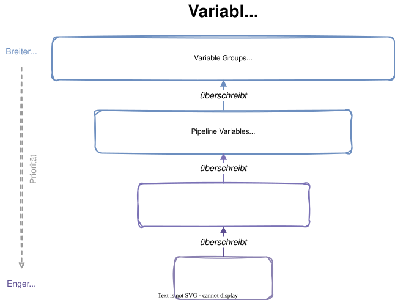
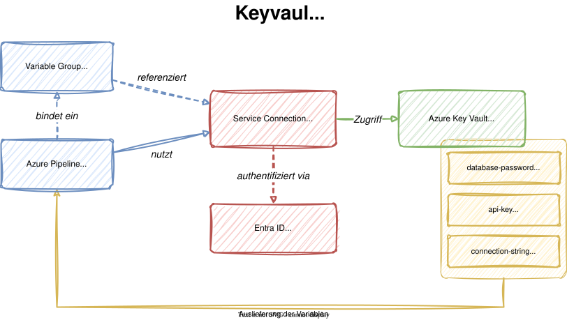

# Modul 03

## Variablen und Secrets

---

## Lernziele

Nach diesem Modul kannst du:

- **Pipeline-Variablen auf verschiedenen Ebenen definieren** - Variable
  Groups, Pipeline-, Stage- und Job-Variablen verstehen und einsetzen
- **Unterschiede zwischen Compile-Time und Runtime-Ausdrücken erklären** - Die drei Syntaxformen korrekt anwenden
- **Secrets sicher verwalten und aus Azure Key Vault laden** - Sensible
  Daten niemals im Klartext, sondern über Key Vault bereitstellen

---

## 1. Variable-Scopes

Azure Pipelines kennt vier Ebenen, auf denen Variablen definiert werden:

- **Variable Groups** - Zentral verwaltete Sammlungen, geteilt zwischen
  mehreren Pipelines
- **Pipeline Variables** - Definiert auf Root-Ebene unter `variables:`
- **Stage Variables** - Nur innerhalb einer Stage gültig
- **Job Variables** - Nur innerhalb eines Jobs gültig

> **Regel:** Ein engerer Scope überschreibt immer den breiteren.

---



---

## 2. Variablen-Syntax

<style scoped>
section {
    font-size: 1.5rem;
}
</style>

Azure Pipelines bietet drei verschiedene Syntaxformen:

| Syntax | Typ | Auswertung |
|:-------|:----|:-----------|
| `$(variableName)` | Macro-Syntax | Runtime (vor jedem Task) |
| `${{ variables.var }}` | Template-Ausdruck | Compile-Time (beim Parsen) |
| `$[variables.var]` | Runtime-Ausdruck | Runtime (bei Bedingungen) |

---

## 2.1 Compile-Time vs. Runtime

<style scoped>
section {
    font-size: 1.4rem;
}
</style>

**Compile-Time** (`${{ }}`):

- Wird beim **Parsen der YAML-Datei** ausgewertet
- Kann auf **Parameter** und **statische Variablen** zugreifen
- Ermöglicht **bedingte Steps** und **Schleifen**

**Runtime** (`$()` und `$[]`):

- Wird **während der Ausführung** ausgewertet
- Kann auf **dynamisch gesetzte Variablen** zugreifen
- `$[]` wird speziell für **Conditions** verwendet

> **Wichtig:** Template-Ausdrücke (`${{ }}`) können nicht auf
> Runtime-Variablen zugreifen.

---

<style scoped>
section {
    font-size: 1.4rem;
}
</style>

## 2.2 Macro-Syntax im Detail

Die häufigste Form ist `$(variableName)`:

```yaml
variables:
  appName: 'my-app'

steps:
  - script: echo "App: $(appName)"
    displayName: 'Variablen ausgeben'
```

In **Bash-Scripts** werden Variablen als Umgebungsvariablen verfügbar:

- Grossbuchstaben, Punkte werden zu Unterstrichen
- `Build.BuildId` wird zu `$BUILD_BUILDID`
- `appName` wird zu `$APPNAME`

---

## 3. Variable Groups

Variable Groups sind zentrale Variablen-Sammlungen:

- Erstellt unter **Pipelines > Library**
- Können von **mehreren Pipelines** verwendet werden
- Unterstützen **geheime Variablen** (`isSecret: true`)
- Können mit **Azure Key Vault** verknüpft werden

```yaml
variables:
  - group: common-settings
  - group: keyvault-secrets
  - name: localVar
    value: 'nur-in-dieser-pipeline'
```

---

## 4. Parameters vs. Variables

<style scoped>
section {
    font-size: 1.5rem;
}
</style>

| Aspekt | Parameters | Variables |
|:-------|:-----------|:----------|
| Definiert mit | `parameters:` | `variables:` |
| Auswertung | Compile-Time | Runtime |
| Zugriff | `${{ parameters.name }}` | `$(name)` |
| Typ-Prüfung | Ja (string, boolean, ...) | Nein (immer String) |
| UI-Eingabe | Ja (bei manuellem Start) | Nein |
| Default-Wert | Möglich | Möglich |

---

### Parameter-Beispiel

```yaml
parameters:
  - name: deployTarget
    displayName: 'Deployment-Ziel'
    type: string
    default: 'staging'
    values:
      - development
      - staging
      - production

  - name: runTests
    displayName: 'Tests ausführen?'
    type: boolean
    default: true
```

---

## 5. Code-Beispiel: Scopes

Hier sehen wir ein Beispiel dafür, dass ein Pipeline Step auf  Variablen jeder Ebene zugreifen kann.

<style scoped>
section {
    font-size: 1.4rem;
}
</style>

```yaml
variables:
  globalVar: 'pipeline-level'

stages:
  - stage: Build
    variables:
      stageVar: 'stage-level'
    jobs:
      - job: Compile
        variables:
          jobVar: 'job-level'
        steps:
          - script: |
              echo "Pipeline: $(globalVar)"
              echo "Stage:    $(stageVar)"
              echo "Job:      $(jobVar)"
```

---

## 5.1 Dynamische Variablen setzen

Variablen können zur Laufzeit mit Logging-Commands gesetzt werden:

```yaml
steps:
  - script: |
      echo "##vso[task.setvariable variable=myDynamic]Hallo"
      TIMESTAMP=$(date -u +%Y-%m-%dT%H:%M:%SZ)
      echo "##vso[task.setvariable variable=buildTime]$TIMESTAMP"
    displayName: 'Dynamische Variablen erzeugen'

  - script: |
      echo "Dynamisch: $(myDynamic)"
      echo "Zeitstempel: $(buildTime)"
    displayName: 'Dynamische Variablen lesen'
```

> `##vso[task.setvariable]` setzt Variablen für **nachfolgende Steps**.

---

## 6. Secrets und sichere Variablen

Sensible Daten gehören **niemals** in den Quellcode:

- **Geheime Pipeline-Variablen** - Mit `isSecret: true` markiert,
  werden im Log als `***` angezeigt
- **Variable Groups mit Secrets** - Zentral verwaltete geheime Werte
- **Key Vault-verknüpfte Variable Groups** - Secrets werden zur
  Laufzeit aus Azure Key Vault geladen

> **Best Practice:** Secrets immer über Azure Key Vault verwalten,
> nicht als Pipeline-Variablen hartcodieren.

---

## 7. Azure Key Vault Integration

Azure Key Vault ist ein verwalteter Dienst für:

- **Secrets** - Passwörter, API-Keys, Connection Strings
- **Keys** - Kryptographische Schlüssel
- **Zertifikate** - TLS/SSL-Zertifikate

**Vorteile gegenüber Pipeline-Variablen:**

- Zentrale Verwaltung für alle Anwendungen
- Audit-Logging aller Zugriffe
- Automatische Rotation möglich
- RBAC-basierte Zugriffskontrolle

---



---

## 7.1 Service Connection für Key Vault

<style scoped>
section {
    font-size: 1.2rem;
}
</style>

Azure DevOps benötigt eine **Service Connection** für den Zugriff:

1. **Project Settings > Service connections** öffnen
2. **Azure Resource Manager** wählen
3. **App Registration (automatic)** auswählen
4. Subscription und Resource Group angeben
5. Zugriff nur für benötigte Pipelines erlauben
   (`Grant access permission to all pipelines` nur im Training)

Der Service Principal braucht im Key Vault:

- **RBAC-Rolle:** `Key Vault Secrets User` oder
- **Access Policy:** `Get` und `List` für Secrets

> **Hinweis (Stand: 27. Februar 2026):**
> Für die Verknüpfung **Variable Group <-> Key Vault** kann die Autorisierung
> mit App Registration (WIF) je nach Tenant/Setup mit einem internen Fehler
> scheitern. Nutze im Training daher den kompatiblen Fallback über
> **klassischen Service Principal + Access Policy**.

---

## 7.2 AzureKeyVault@2 Task

<style scoped>
section {
    font-size: 1.4rem;
}
</style>

Der Task lädt Secrets direkt als Pipeline-Variablen:

```yaml
steps:
  - task: AzureKeyVault@2
    inputs:
      azureSubscription: 'azure-training-connection'
      KeyVaultName: 'kv-training-abc123'
      SecretsFilter: 'database-password,api-key'
      RunAsPreJob: false
    displayName: 'Secrets aus Key Vault laden'

  - script: |
      if [ -n "$(database-password)" ] && [ -n "$(api-key)" ]; then
        echo "Secrets erfolgreich geladen."
      else
        echo "FEHLER: Mindestens ein Secret fehlt!" && exit 1
      fi
    displayName: 'Secrets validieren'
```

---

## 7.3 Variable Group mit Key Vault

<style scoped>
section {
    font-size: 1.2rem;
}
</style>

Alternativ kann eine **Variable Group** mit dem Key Vault verknüpft werden:

1. **Pipelines > Library > + Variable group**
2. Toggle: **Link secrets from an Azure key vault**
3. Service Connection und Key Vault auswählen
4. Gewünschte Secrets hinzufügen

```yaml
variables:
  - group: common-settings
  - group: keyvault-secrets   # Key Vault-verknüpft

steps:
  - script: |
      if [ -n "$(database-password)" ]; then
        echo "Secret verfügbar."
      else
        echo "Secret fehlt!" && exit 1
      fi
    displayName: 'Key Vault Secrets nutzen'
```

---

## 7.4 Code-Beispiel: Vollständige Key Vault Pipeline

<style scoped>
section {
    font-size: 1rem;
}
</style>

```yaml
trigger:
  branches:
    include:
      - main

variables:
  - group: common-settings
  - group: keyvault-secrets

pool:
  vmImage: 'ubuntu-latest'

steps:
  - script: |
      echo "Environment: $(ENVIRONMENT)"
      if [ -n "$(database-password)" ]; then
        echo "Secret ist gesetzt."
      else
        echo "FEHLER: Secret fehlt!" && exit 1
      fi
    displayName: 'Konfiguration prüfen'

  - script: |
      if [ -n "$(database-password)" ] && [ -n "$(api-key)" ]; then
        echo "Alle erforderlichen Secrets sind vorhanden."
      else
        echo "FEHLER: Erforderliche Secrets fehlen!" && exit 1
      fi
    displayName: 'Secrets validieren'
```

---

## Labs

- **Lab 04:** Variablen und Variable Groups
- **Lab 05:** Secrets mit Azure Key Vault verknüpfen
