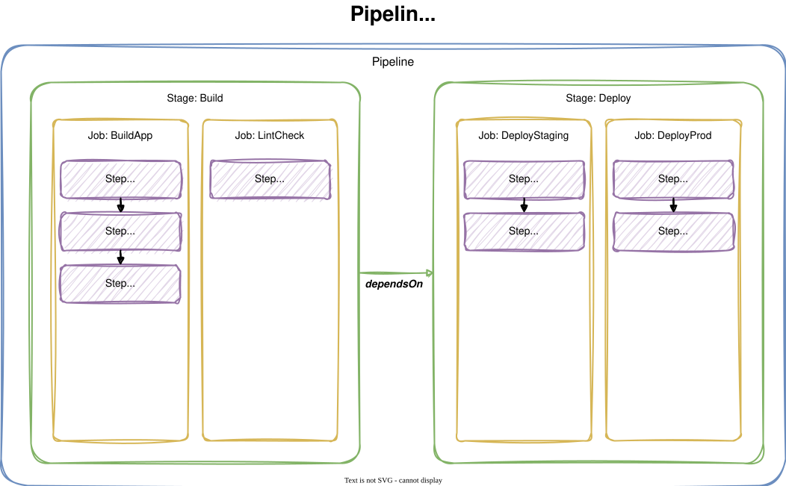
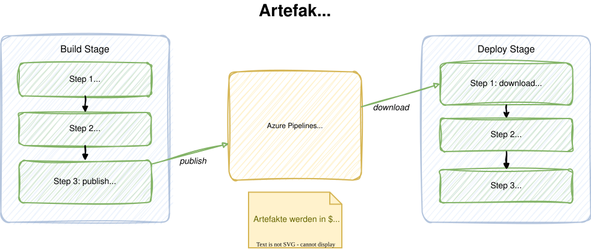

# Modul 04

## Multi-Stage Pipelines

---

## Lernziele

Nach diesem Modul kannst du:

- **Multi-Stage Pipelines aufbauen** - Pipelines mit mehreren Stages
  (Build, Test, Deploy) strukturieren und Abhängigkeiten definieren
- **Artefakte zwischen Stages austauschen** - Build-Ergebnisse
  publizieren und in nachfolgenden Stages herunterladen
- **Bedingte Ausführung steuern** - Mit Conditions kontrollieren,
  welche Stages und Jobs unter welchen Bedingungen laufen

---

## 1. Pipeline-Hierarchie

Eine Azure Pipeline besteht aus vier verschachtelten Ebenen:

- **Pipeline** - Die äußerste Einheit, definiert in
  `azure-pipelines.yml`
- **Stage** - Eine logische Phase (z.B. Build, Test, Deploy)
- **Job** - Eine Ausführungseinheit auf einem Agent
- **Step** - Ein einzelner Befehl oder Task

> Jede Ebene enthält eine oder mehrere Einheiten der
> nächsttieferen Ebene.

---



---

## 1.1 Implizite vs. explizite Struktur

<style scoped>
section {
    font-size: 1.5rem;
}
</style>

Bei einfachen Pipelines kannst du Stages und Jobs weglassen - Azure
Pipelines erstellt sie implizit:

```yaml
# Implizit: eine Stage, ein Job
steps:
  - script: echo "Hello"
```

```yaml
# Explizit: volle Kontrolle
stages:
  - stage: Build
    jobs:
      - job: BuildJob
        steps:
          - script: echo "Hello"
```

> Sobald du mehrere Stages oder Jobs brauchst, musst du die
> Hierarchie **explizit** angeben.

---

<style scoped>
section {
    font-size: 1.5rem;
}
</style>

## 2. Stages definieren

Stages werden als Liste unter dem Schlüssel `stages` definiert:

```yaml
stages:
  - stage: Build
    displayName: 'Build Stage'
    jobs:
      - job: BuildJob
        pool:
          vmImage: 'ubuntu-latest'
        steps:
          - script: npm run build

  - stage: Test
    displayName: 'Test Stage'
    dependsOn: Build
    jobs:
      - job: TestJob
        steps:
          - script: npm test
```

---

## 2.1 dependsOn und Ausführungsreihenfolge

<style scoped>
section {
    font-size: 1.3rem;
}
</style>

Ohne `dependsOn` laufen Stages **sequenziell** in der Reihenfolge
ihrer Definition. Mit `dependsOn` kontrollierst du die
Abhängigkeiten:

```yaml
# Sequenziell (Standard)
stages:
  - stage: Build      # läuft zuerst
  - stage: Test       # wartet auf Build
  - stage: Deploy     # wartet auf Test
```

```yaml
# Parallel: Test und Scan starten nach Build gleichzeitig
stages:
  - stage: Build
  - stage: Test
    dependsOn: Build
  - stage: Scan
    dependsOn: Build
  - stage: Deploy
    dependsOn:
      - Test
      - Scan
```

---

## 3. Conditions

Conditions steuern, **ob** eine Stage oder ein Job ausgeführt wird:

```yaml
- stage: DeployStaging
  dependsOn: Test
  condition: >-
    and(
      succeeded(),
      eq(variables['Build.SourceBranchName'], 'main')
    )
```

Die Deploy-Stage läuft nur, wenn:

1. Die vorherige Stage **erfolgreich** war (`succeeded()`)
2. Der Build auf dem **main-Branch** läuft

---

## 3.1 Condition-Funktionen

<style scoped>
section { font-size: 1.3rem; }
</style>

| Funktion       | Beschreibung                                 | Beispiel                                     |
|:---------------|:---------------------------------------------|:---------------------------------------------|
| `succeeded()`  | Alle vorherigen Stages/Jobs erfolgreich      | Standard-Condition                           |
| `failed()`     | Mindestens eine vorherige Stage fehlgeschlagen | Fehlerbehandlung, Benachrichtigung          |
| `always()`     | Läuft immer, unabhängig vom Ergebnis         | Cleanup, Logging                             |
| `canceled()`   | Pipeline wurde abgebrochen                   | Cleanup nach Abbruch                         |
| `eq(a, b)`     | Werte sind gleich                            | `eq(variables['Build.Reason'], 'Schedule')`  |
| `ne(a, b)`     | Werte sind ungleich                          | `ne(variables['Build.Reason'], 'PullRequest')` |
| `contains(a,b)`| String a enthält b                           | `contains(variables['...'], 'release')`  |
| `and(a, b)`    | Beide Bedingungen wahr                       | Kombination mehrerer Prüfungen               |
| `or(a, b)`     | Mindestens eine Bedingung wahr               | Alternative Bedingungen                      |

---

## 3.2 Conditions - Beispiele

<style scoped>
section { font-size: 1.4rem; }
</style>
```yaml
# Nur auf main-Branch deployen
condition: >-
  and(succeeded(),
      eq(variables['Build.SourceBranchName'], 'main'))

# Immer ausführen (auch bei Fehler)
condition: always()

# Nicht bei Pull Requests
condition: >-
  and(succeeded(),
      ne(variables['Build.Reason'], 'PullRequest'))

# Nur bei getaggten Builds
condition: >-
  and(succeeded(),
      startsWith(variables['Build.SourceBranch'],
                 'refs/tags/'))
```

---

## 4. Jobs innerhalb von Stages

<style scoped>
section { font-size: 1.3rem; }
</style>
Jede Stage enthält einen oder mehrere Jobs. Jobs innerhalb einer
Stage laufen standardmäßig **parallel**:

```yaml
- stage: Test
  jobs:
    - job: UnitTests
      pool:
        vmImage: 'ubuntu-latest'
      steps:
        - script: npm test

    - job: LintCheck
      pool:
        vmImage: 'ubuntu-latest'
      steps:
        - script: npm run lint
```

> UnitTests und LintCheck laufen **gleichzeitig** auf separaten Agents.

---

## 4.1 Sequenzielle Jobs mit dependsOn

Wenn Jobs aufeinander aufbauen, verwende `dependsOn`:

```yaml
- stage: Test
  jobs:
    - job: UnitTests
      steps:
        - script: npm test

    - job: IntegrationTests
      dependsOn: UnitTests
      steps:
        - script: npm run test:integration
```

> Mit `dependsOn` laufen Jobs **nacheinander** statt parallel.

---

## 5. Artefakte

Artefakte sind die **Ergebnisse eines Build-Prozesses**: kompilierte
Binaries, Pakete, Konfigurationsdateien oder Deployables.

Azure Pipelines bietet zwei Mechanismen:

| Methode               | Keywords                  | Empfehlung      |
|:----------------------|:--------------------------|:----------------|
| **Pipeline Artifacts** | `publish` / `download`   | Empfohlen       |
| **Build Artifacts**    | `PublishBuildArtifacts@1` | Legacy          |

> Pipeline Artifacts sind **schneller** und einfacher zu
> verwenden als die ältere Build-Artifacts-Methode.

---

## 5.1 Artefakte publizieren

<style scoped>
section { font-size: 1.4rem; }
</style>
Mit dem `publish`-Keyword (Shortcut für `PublishPipelineArtifact@1`):

```yaml
stages:
  - stage: Build
    jobs:
      - job: BuildApp
        steps:
          - script: npm run build

          # Gesamtes dist/-Verzeichnis publizieren
          - publish: $(System.DefaultWorkingDirectory)/dist
            artifact: app-dist
            displayName: 'App-Artefakte publizieren'

          # Einzelne Datei separat publizieren
          - publish: $(System.DefaultWorkingDirectory)/dist/manifest.json
            artifact: build-metadata
            displayName: 'Metadata publizieren'
```

---

## 5.2 Artefakte herunterladen

<style scoped>
section { font-size: 1.5rem; }
</style>
In einer nachfolgenden Stage mit `download` (Shortcut für `DownloadPipelineArtifact@1`):

```yaml
- stage: Deploy
  dependsOn: Build
  jobs:
    - job: DeployJob
      steps:
        - download: current
          artifact: app-dist
          displayName: 'Artefakte herunterladen'

        - script: |
            echo "Dateien im Workspace:"
            ls -la $(Pipeline.Workspace)/app-dist/
          displayName: 'Artefakte prüfen'
```

> `download: current` lädt Artefakte des **aktuellen** Pipeline-Runs herunter.

---



---

## 5.3 .artifactignore

Mit `.artifactignore` (gleiche Syntax wie `.gitignore`) kannst du
Dateien vom Upload ausschliessen:

```gitignore
# .artifactignore im Quellverzeichnis
node_modules/
*.log
*.tmp
.env
```

> Große Artefakte verlangsamen Upload und Download.
> Schließe unnötige Dateien konsequent aus.

---

## 6. Output-Variablen zwischen Jobs

<style scoped>
section { font-size: 1.4rem; }
</style>
Jobs laufen auf **separaten Agents** und teilen keinen Zustand.
Mit Output-Variablen kannst du Werte weitergeben:

```yaml
jobs:
  - job: BuildJob
    steps:
      - script: |
          echo "##vso[task.setvariable \
            variable=buildVersion;isOutput=true]1.2.3"
        name: setVersion

  - job: DeployJob
    dependsOn: BuildJob
    variables:
      version: >-
        $[ dependencies.BuildJob.outputs
           ['setVersion.buildVersion'] ]
    steps:
      - script: echo "Deploying version $(version)"
```

---

## 6.1 Output-Variablen zwischen Stages

<style scoped>
section { font-size: 1.2rem; }
</style>
Zwischen Stages funktioniert die Syntax ähnlich, mit zusätzlicher Stage-Referenz:

```yaml
stages:
  - stage: Build
    jobs:
      - job: BuildJob
        steps:
          - script: |
              echo "##vso[task.setvariable \
                variable=imageTag;isOutput=true]\
                $(Build.BuildId)"
            name: setTag

  - stage: Deploy
    dependsOn: Build
    variables:
      tag: >-
        $[ stageDependencies.Build.BuildJob.outputs
           ['setTag.imageTag'] ]
    jobs:
      - job: DeployJob
        steps:
          - script: echo "Tag: $(tag)"
```

---

## 7. Code-Beispiel: Vollständige Multi-Stage Pipeline

<style scoped>
section {
    font-size: 0.7rem;
}
</style>

```yaml
trigger:
  branches:
    include: [main]

stages:
  - stage: Build
    displayName: 'Build'
    jobs:
      - job: BuildApp
        pool: { vmImage: 'ubuntu-latest' }
        steps:
          - script: npm run build
          - publish: $(System.DefaultWorkingDirectory)/dist
            artifact: app-dist

  - stage: Test
    dependsOn: Build
    jobs:
      - job: UnitTests
        steps: [{ script: npm test }]
      - job: LintCheck
        steps: [{ script: npm run lint }]

  - stage: DeployStaging
    dependsOn: Test
    condition: and(succeeded(), eq(variables['Build.SourceBranchName'], 'main'))
    jobs:
      - job: Deploy
        steps:
          - download: current
            artifact: app-dist
          - script: echo "Deploy to Staging..."

  - stage: DeployProduction
    dependsOn: DeployStaging
    condition: and(succeeded(), eq(variables['Build.SourceBranchName'], 'main'))
    jobs:
      - job: Deploy
        steps:
          - download: current
            artifact: app-dist
          - script: echo "Deploy to Production..."
```

---

## 8. Best Practices

<style scoped>
section { font-size: 1.4rem; }
</style>
- **Stages logisch trennen** - Build, Test und Deploy in separate
  Stages aufteilen
- **Parallele Jobs nutzen** - Unabhängige Aufgaben (Unit Tests,
  Lint, Security Scan) parallel ausführen
- **Artefakte explizit benennen** - Sprechende Namen wie `app-dist`
  statt `drop` verwenden
- **Conditions gezielt einsetzen** - Deploy-Stages nur auf dem
  main-Branch ausführen
- **`.artifactignore` verwenden** - Unnötige Dateien vom
  Artefakt-Upload ausschließen
- **Output-Variablen dokumentieren** - Klare Benennung für
  Variablen, die zwischen Jobs/Stages geteilt werden

---

## Labs

- **Lab 06:** Multi-Stage Pipelines
- **Lab 07:** Build-Artefakte erzeugen und publizieren
