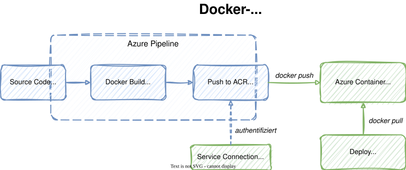
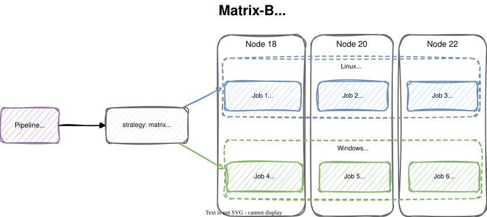

# Modul 05

## Containerisierung und Optimierung

---

## Lernziele

Nach diesem Modul kannst du:

- **Docker-Images in Pipelines bauen und in ACR pushen** - Den `Docker@2`
  Task nutzen, um Multi-Stage-Images zu erzeugen und in einer Azure
  Container Registry bereitzustellen
- **Pipeline-Caching einsetzen, um Build-Zeiten zu verkürzen** - Mit dem
  `Cache@2` Task Abhängigkeiten zwischen Läufen wiederverwenden und
  Cache-Keys richtig definieren
- **Matrix-Builds für mehrere Plattformen und Versionen konfigurieren** -
  Eine Matrix-Strategie definieren, um Tests parallel auf verschiedenen OS-
  und Runtime-Kombinationen auszuführen

---

## 1. Docker in Azure Pipelines

<style scoped>
section { font-size: 1.5rem; }
</style>
Azure Pipelines bietet native Unterstützung für Docker-Workflows:

- **`Docker@2` Task** - Vereinfacht Build, Push und Login in einer
  einheitlichen Konfiguration
- **Container Jobs** - Jobs können direkt in einem Container-Image
  ausgeführt werden
- **Service Container** - Abhängigkeiten (Datenbanken, Caches) als
  Sidecar-Container starten
- **Azure Container Registry (ACR)** - Verwalteter Docker-Registry-Dienst in Azure

> **Vorteil:** Reproduzierbare Builds, konsistente Umgebungen und
> Integration in Azure-Deployment-Zielen.

---

## 1.1 Der `Docker@2` Task

<style scoped>
section {
    font-size: 1.2rem;
}
</style>

Der `Docker@2` Task unterstützt mehrere Befehle:

| Befehl          | Beschreibung                                |
|:----------------|:--------------------------------------------|
| `build`         | Baut ein Docker-Image aus einem Dockerfile  |
| `push`          | Pusht ein Image in eine Registry            |
| `buildAndPush`  | Baut und pusht in einem Schritt             |
| `login`         | Authentifiziert gegen eine Registry         |
| `logout`        | Beendet die Registry-Sitzung               |

```yaml
- task: Docker@2
  inputs:
    containerRegistry: 'acr-connection'
    repository: 'my-app'
    command: 'buildAndPush'
    Dockerfile: '**/Dockerfile'
    tags: |
      $(Build.BuildNumber)
      latest
```

---

## 1.2 Azure Container Registry (ACR)

<style scoped>
section { font-size: 1.5rem; }
</style>
ACR ist ein verwalteter Docker-Registry-Dienst in Azure:

- **SKUs:** Basic, Standard, Premium (Geo-Replikation, Private Link)
- **Authentifizierung:** Service Principal, Managed Identity oder Admin-Account
- **Integration:** Direkt mit AKS, App Service und Container Instances
  verknüpfbar

```bash
# ACR erstellen
az acr create \
  --name myacr \
  --resource-group rg-training \
  --sku Basic \
  --admin-enabled true
```

---

## 1.3 Service Connection für ACR

<style scoped>
section { font-size: 1.5rem; }
</style>
Die Pipeline benötigt eine **Service Connection** zur ACR:

1. **Project Settings** > **Service connections**
2. **New service connection** > **Docker Registry**
3. Registry Type: **Azure Container Registry**
4. Authentication: **Service Principal**
5. ACR auswählen und Namen vergeben

```yaml
variables:
  acrName: 'myacr'
  acrLoginServer: 'myacr.azurecr.io'
  imageName: 'hello-pipeline'
  imageTag: '$(Build.BuildNumber)'
```

---



---

## 1.4 Multi-Stage Dockerfiles

<style scoped>
section { font-size: 1.3rem; }
</style>
Multi-Stage Builds trennen **Build-Umgebung** von **Production-Image**:

```dockerfile
# Stage 1: Build
FROM node:20-alpine AS build
WORKDIR /app
COPY package.json ./
COPY src/ ./src/
COPY index.html ./
RUN mkdir -p dist && cp src/*.js dist/ && cp index.html dist/

# Stage 2: Production
FROM nginx:alpine
COPY --from=build /app/dist/ /usr/share/nginx/html/
EXPOSE 80
HEALTHCHECK --interval=30s --timeout=3s \
  CMD wget -q --spider http://localhost/ || exit 1
```

> **Ergebnis:** Das finale Image enthält nur nginx + statische Dateien - kein Node.js, kein Quellcode, minimale Angriffsfläche.

---

## 1.5 Komplette Pipeline: Docker Build + ACR Push

<style scoped>
section { font-size: 1rem; }
</style>

```yaml
stages:
  - stage: Build
    jobs:
      - job: DockerBuild
        pool:
          vmImage: 'ubuntu-latest'
        steps:
          - task: Docker@2
            displayName: 'Build and Push'
            inputs:
              containerRegistry: 'acr-training-connection'
              repository: '$(imageName)'
              command: 'buildAndPush'
              Dockerfile: '**/Dockerfile'
              tags: |
                $(imageTag)
                latest
  - stage: Verify
    dependsOn: Build
    jobs:
      - job: VerifyImage
        steps:
          - task: AzureCLI@2
            inputs:
              azureSubscription: 'azure-connection'
              scriptType: 'bash'
              inlineScript: |
                az acr repository show-tags \
                  --name $(acrName) \
                  --repository $(imageName)
```

---

## 2. Caching mit dem `Cache@2` Task

Pipelines, die bei jedem Lauf Abhängigkeiten herunterladen, verschwenden
Zeit und Bandbreite. Der **`Cache@2` Task** speichert Verzeichnisse zwischen
Pipeline-Läufen.

- **Erster Lauf:** Kein Cache vorhanden - Pakete werden heruntergeladen,
  Cache wird gespeichert
- **Folgende Läufe:** Cache wird wiederhergestellt - deutlich schneller
  (oft **30-50% Zeitersparnis**)
- **Geänderte Abhängigkeiten:** Cache-Key ändert sich, Fallback auf
  Restore-Keys

---

## 2.1 Cache-Keys und Restore-Keys

<style scoped>
section {
    font-size: 1.2rem;
}
</style>

Der **Cache-Key** bestimmt, ob ein Cache wiederverwendet wird:

```yaml
- task: Cache@2
  inputs:
    key: 'npm | "$(Agent.OS)" | package-lock.json'
    restoreKeys: |
      npm | "$(Agent.OS)"
    path: '$(Pipeline.Workspace)/.npm'
```

| Bestandteil           | Bedeutung                                |
|:----------------------|:-----------------------------------------|
| `npm`                 | Präfix zur Unterscheidung verschiedener Caches  |
| `"$(Agent.OS)"`       | OS-spezifischer Cache                    |
| `package-lock.json`   | Hash der Datei - ändert sich bei neuen Abhängigkeiten |

> **Restore-Keys:** Falls der exakte Key nicht passt, wird der neueste
> Cache gesucht, dessen Key mit einem Restore-Key **beginnt**.

---

## 2.2 npm-Cache Beispiel

<style scoped>
section {
    font-size: 1.4rem;
}
</style>

```yaml
variables:
  npm_config_cache: $(Pipeline.Workspace)/.npm

steps:
  - task: Cache@2
    displayName: 'npm Cache wiederherstellen'
    inputs:
      key: 'npm | "$(Agent.OS)" | package-lock.json'
      restoreKeys: |
        npm | "$(Agent.OS)"
      path: '$(npm_config_cache)'

  - script: npm ci
    displayName: 'Abhängigkeiten installieren'
```

> **Wichtig:** `npm ci` statt `npm install` verwenden - es nutzt die
> `package-lock.json` strikt und ist für CI/CD optimiert.

---

## 2.3 pip-Cache Beispiel

<style scoped>
section {
    font-size: 1.6rem;
}
</style>

```yaml
variables:
  pip_cache_dir: $(Pipeline.Workspace)/.pip

steps:
  - task: Cache@2
    displayName: 'pip Cache wiederherstellen'
    inputs:
      key: 'pip | "$(Agent.OS)" | requirements.txt'
      restoreKeys: |
        pip | "$(Agent.OS)"
      path: '$(pip_cache_dir)'

  - script: pip install --cache-dir $(pip_cache_dir) -r requirements.txt
    displayName: 'Python-Pakete installieren'
```

---

## 2.4 Pipeline-Performance-Optimierung

<style scoped>
section {
    font-size: 1.3rem;
}
</style>

Neben Caching gibt es weitere Strategien zur Beschleunigung:

| Strategie                    | Effekt                                  |
|:-----------------------------|:----------------------------------------|
| **Cache@2 Task**             | Abhängigkeiten wiederverwenden          |
| **Matrix-Builds**            | Tests parallelisieren                   |
| **Docker Layer Caching**     | Docker-Builds beschleunigen             |
| **Shallow Checkout**         | Weniger Git-Historie laden              |
| **Parallele Jobs**           | Unabhängige Jobs gleichzeitig starten   |
| **Inkrementelle Builds**     | Nur geänderte Teile neu bauen           |

```yaml
steps:
  - checkout: self
    fetchDepth: 1  # Shallow Clone - nur letzter Commit
```

---

## 3. Matrix-Builds

<style scoped>
section {
    font-size: 1.4rem;
}
</style>
Wenn eine Anwendung auf **mehreren Plattformen** oder mit **verschiedenen
Runtime-Versionen** laufen soll, generiert die **Matrix-Strategie**
automatisch Jobs für jede Kombination.

- **Ohne Matrix:** Für jede Kombination einen eigenen Job schreiben
- **Mit Matrix:** Eine Definition, viele automatisch erzeugte Jobs
- **maxParallel:** Begrenzt die gleichzeitigen Jobs

```yaml
strategy:
  matrix:
    Linux_Node18:
      vmImage: 'ubuntu-latest'
      nodeVersion: '18.x'
    Linux_Node20:
      vmImage: 'ubuntu-latest'
      nodeVersion: '20.x'
  maxParallel: 4
```

---



---

## 3.1 matrix, maxParallel und Variablen

<style scoped>
section {
    font-size: 1.2rem;
}
</style>

Jeder Matrix-Eintrag definiert **Variablen**, die im Job verfügbar sind:

```yaml
strategy:
  matrix:
    Linux_Node18:
      vmImage: 'ubuntu-latest'
      nodeVersion: '18.x'
      osName: 'Linux'
    Windows_Node20:
      vmImage: 'windows-latest'
      nodeVersion: '20.x'
      osName: 'Windows'
  maxParallel: 4

pool:
  vmImage: $(vmImage)    # Aus der Matrix-Variable

steps:
  - task: NodeTool@0
    inputs:
      versionSpec: '$(nodeVersion)'  # Aus der Matrix-Variable
```

> **maxParallel** begrenzt die Parallelität. Nützlich, wenn man kostenpflichtige Parallel-Jobs schonen will.

---

## 3.2 Code-Beispiel: Vollständiger Matrix-Build

<style scoped>
section {
    font-size: 1rem;
}
</style>

```yaml
stages:
  - stage: MatrixTest
    displayName: 'Matrix: OS x Node Versionen'
    jobs:
      - job: TestMatrix
        strategy:
          matrix:
            Linux_Node18:
              vmImage: 'ubuntu-latest'
              nodeVersion: '18.x'
            Linux_Node20:
              vmImage: 'ubuntu-latest'
              nodeVersion: '20.x'
            Windows_Node18:
              vmImage: 'windows-latest'
              nodeVersion: '18.x'
            Windows_Node20:
              vmImage: 'windows-latest'
              nodeVersion: '20.x'
          maxParallel: 4
        pool:
          vmImage: $(vmImage)
        steps:
          - task: NodeTool@0
            inputs:
              versionSpec: '$(nodeVersion)'
          - script: node test/cross-platform-test.js
            displayName: 'Cross-Platform Tests'
            env:
              TEST_ENV: 'matrix-$(Agent.OS)-$(nodeVersion)'
```

---

## 4. Kombination: Container + Cache + Matrix

<style scoped>
section {
    font-size: 1rem;
}
</style>

Die drei Techniken lassen sich kombinieren für maximale Effizienz:

```yaml
strategy:
  matrix:
    Linux_Node20:
      vmImage: 'ubuntu-latest'
      nodeVersion: '20.x'
    Windows_Node20:
      vmImage: 'windows-latest'
      nodeVersion: '20.x'

steps:
  - task: Cache@2
    inputs:
      key: 'npm | "$(Agent.OS)" | package-lock.json'
      path: '$(Pipeline.Workspace)/.npm'

  - script: npm ci
  - script: npm test

  - task: Docker@2
    condition: eq(variables['Agent.OS'], 'Linux')
    inputs:
      command: 'buildAndPush'
      containerRegistry: 'acr-connection'
      repository: 'my-app'
```

---

## Labs

- **Lab 08:** Docker-Images bauen und in ACR pushen
- **Lab 09:** Caching-Strategien
- **Lab 10:** Matrix-Builds für mehrere Plattformen/Versionen
