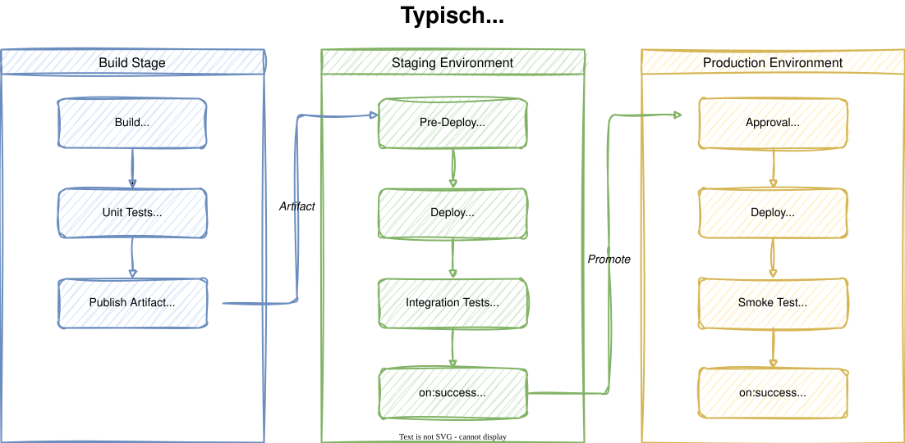
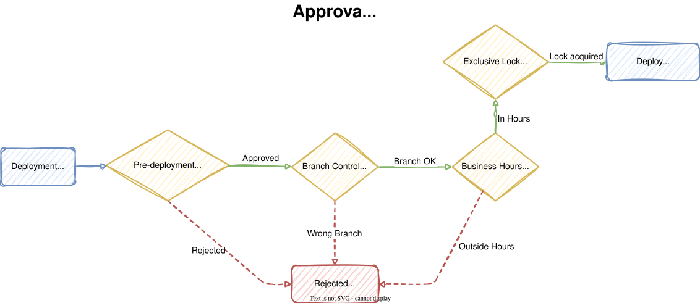

# Modul 06

## Deployment-Strategien

---

## Lernziele

Nach diesem Modul kannst du:

- **Deployment Jobs und Environments einsetzen** - Den Unterschied zwischen
  normalen Jobs und Deployment Jobs erklären und Environments für Tracking,
  Auditing und Deployment-Historie nutzen
- **Approval Gates und Checks konfigurieren** - Manuelle Freigaben,
  Branch Control, Business Hours und Exclusive Locks einrichten, um
  Production-Deployments abzusichern
- **Anwendungen auf Azure App Service deployen** - Eine Pipeline bauen,
  die über Service Connections eine Web-App auf Azure App Service ausrollt
  und mit Health Checks validiert

---

## 1. Deployment Jobs vs. reguläre Jobs

<style scoped>
section {
    font-size: 1.5rem;
}
</style>
Ein **Deployment Job** ist ein spezieller Job-Typ in Azure Pipelines:

| Aspekt               | Regulärer Job (`job`)       | Deployment Job (`deployment`)        |
|:----------------------|:-----------------------------|:-------------------------------------|
| Keyword              | `job`                        | `deployment`                         |
| Strategien           | Keine                        | `runOnce`, `rolling`, `canary`       |
| Lifecycle-Hooks      | Keine                        | `preDeploy`, `deploy`, `on:success`  |
| Environment-Tracking | Nein                         | Ja (Historie, Auditing)              |
| Artefakt-Download    | Manuell                      | Automatisch                          |

> **Empfehlung:** Verwende `deployment` für alles, was auf eine
> Zielumgebung ausgerollt wird.

---

## 2. Das `deployment` Keyword und `strategy`

<style scoped>
section {
    font-size: 1.3rem;
}
</style>

```yaml
jobs:
  - deployment: DeployToStaging
    displayName: 'Deploy to Staging'
    pool:
      vmImage: 'ubuntu-latest'
    environment: 'staging'
    strategy:
      runOnce:
        preDeploy:
          steps:
            - script: echo "Voraussetzungen prüfen..."
        deploy:
          steps:
            - script: echo "Deployment läuft..."
        on:
          success:
            steps:
              - script: echo "Deployment erfolgreich!"
          failure:
            steps:
              - script: echo "Rollback einleiten..."
```

---

## 2.1 Deployment-Strategien im Überblick

<style scoped>
section {
    font-size: 1.5rem;
}
</style>

| Strategie    | Beschreibung                                    | Einsatz                |
|:-------------|:------------------------------------------------|:-----------------------|
| **runOnce**  | Einmaliges Deployment auf alle Targets           | Standard, einfach.     |
| **rolling**  | Schrittweises Update (Batch für Batch)          | VM-basierte Workloads  |
| **canary**   | Deployment auf einen Teil der Targets, dann alle | Risikoarme Rollouts    |

**Lifecycle-Hooks** (verfügbar in allen Strategien):

- `preDeploy` - Vor dem Deployment (z.B. DB-Migration prüfen)
- `deploy` - Das eigentliche Deployment
- `routeTraffic` - Traffic umleiten (Canary/Blue-Green)
- `postRouteTraffic` - Nach der Umleitung (z.B. Integration Tests)
- `on:success` / `on:failure` - Abschluss-Hooks

---

## 3. Environments

**Environments** repräsentieren Zielumgebungen in Azure DevOps:

- **Tracking** - Jedes Deployment wird protokolliert
- **Historie** - Wer hat wann was deployt?
- **Auditing** - Vollständige Nachvollziehbarkeit von Änderungen
- **Checks & Approvals** - Schutz für kritische Umgebungen

---

## 3.1 Environment-Konfiguration

<style scoped>
section {
    font-size: 1.5rem;
}
</style>
Environments werden unter **Pipelines > Environments** angelegt:

| Environment   | Beschreibung            | Typische Checks              |
|:--------------|:------------------------|:-----------------------------|
| `dev`         | Entwicklungsumgebung    | Keine (Auto-Deploy)          |
| `staging`     | Staging/Test-Umgebung   | Business Hours               |
| `production`  | Produktionsumgebung     | Approval, Branch Control, Exclusive Lock     |

Environments werden automatisch erstellt, wenn eine Pipeline sie zum
ersten Mal referenziert. Für Approvals müssen sie vorab manuell
angelegt werden.

---



---

## 4. Approval Gates

**Approval Gates** schützen kritische Environments vor unkontrollierten
Deployments. Azure DevOps bietet vier Typen:

- **Manual Approval** - Manuelle Freigabe durch definierte Personen
- **Branch Control** - Nur Deployments von bestimmten Branches
  (z.B. `refs/heads/main`)
- **Business Hours** - Deployments nur während Geschäftszeiten
  (z.B. Mo-Fr 08:00-18:00)
- **Exclusive Lock** - Maximal ein Deployment gleichzeitig pro Environment

---



---

## 4.1 Konfiguration von Approvals

<style scoped>
section {
    font-size: 1.2rem;
}
</style>

Approvals werden über die Web-Oberfläche konfiguriert:

1. **Pipelines > Environments** > Environment auswählen
2. Drei Punkte (**...**) > **"Approvals and checks"**
3. **"+ Add check"** > Typ auswählen

**Approval-Einstellungen:**

| Einstellung                    | Empfehlung                           |
|:-------------------------------|:-------------------------------------|
| Approvers                      | Mindestens 2 Personen                |
| Minimum number of approvers    | `1` (oder mehr für Vier-Augen)      |
| Allow self-approval            | Nein (Ausnahme: Training)            |
| Timeout                        | `1440` Minuten (24 Stunden)          |
| Instructions                   | Klare Anweisungen für den Approver  |

> **Branch Control**: `refs/heads/main` stellt sicher, dass nur getesteter Code in Production gelangt.

---

## 5. Code-Beispiel: Deployment Job

<style scoped>
section {
    font-size: 1.2rem;
}
</style>

```yaml
stages:
  - stage: Build
    jobs:
      - job: BuildApp
        pool:
          vmImage: 'ubuntu-latest'
        steps:
          - script: |
              mkdir -p dist
              cp src/*.js dist/
              echo '{"version": "$(appVersion)"}' > dist/version.json
          - publish: dist
            artifact: app-package

  - stage: DeployDev
    dependsOn: Build
    jobs:
      - deployment: DeployToDev
        environment: 'dev'
        strategy:
          runOnce:
            deploy:
              steps:
                - script: echo "Deploy to Dev..."
```

---

## 5.1 Multi-Stage Deployment Pipeline

<style scoped>
section {
    font-size: 1rem;
}
</style>

```yaml
  - stage: DeployStaging
    dependsOn: DeployDev
    jobs:
      - deployment: DeployToStaging
        environment: 'staging'
        strategy:
          runOnce:
            preDeploy:
              steps:
                - script: echo "Pre-Deploy Checks..."
            deploy:
              steps:
                - script: echo "Deploy to Staging..."
            postRouteTraffic:
              steps:
                - script: echo "Integration Tests..."

  - stage: DeployProduction
    dependsOn: DeployStaging
    condition: >-
      and(succeeded(),
      eq(variables['Build.SourceBranchName'], 'main'))
    jobs:
      - deployment: DeployToProd
        environment: 'production'
        strategy:
          runOnce:
            deploy:
              steps:
                - script: echo "Deploy to Production..."
```

---

## 6. App Service Deployment

<style scoped>
section {
    font-size: 1.5rem;
}
</style>

**Azure App Service** ist ein PaaS-Dienst zum Hosten von Webanwendungen.
Der `AzureWebApp@1`-Task deployt Anwendungen direkt:

```yaml
- task: AzureWebApp@1
  displayName: 'Deploy to App Service'
  inputs:
    azureSubscription: '$(azureSubscription)'
    appType: 'webAppLinux'
    appName: '$(appName)'
    package: '$(Pipeline.Workspace)/web-app/app.zip'
    runtimeStack: 'NODE|20-lts'
```

> **Voraussetzung:** Eine Service Connection vom Typ
> **Azure Resource Manager** muss konfiguriert sein.

---

<style scoped>
section {
    font-size: 1.5rem;
}
</style>

## 6.1 Service Connection für Azure

Eine **Service Connection** verbindet Azure DevOps mit Azure:

1. **Project Settings > Service connections**
2. **"New service connection"** > **Azure Resource Manager**
3. Authentifizierung: **Service Principal (automatic)**
4. Subscription und Resource Group auswählen
5. Name vergeben (z.B. `azure-training-connection`)

```yaml
variables:
  azureSubscription: 'azure-training-connection'
  appName: 'app-training-team01'
```

> Die Service Connection benötigt **Contributor**-Rechte auf die
> Resource Group, in der der App Service liegt.

---

## 6.2 Deployment zu verschiedenen Environments

<style scoped>
section {
    font-size: 1rem;
}
</style>

```yaml
stages:
  - stage: Build
    jobs:
      - job: BuildApp
        steps:
          - script: npm install --production
          - task: ArchiveFiles@2
            inputs:
              rootFolderOrFile: '$(System.DefaultWorkingDirectory)'
              includeRootFolder: false
              archiveType: 'zip'
              archiveFile: '$(Build.ArtifactStagingDirectory)/app.zip'
          - publish: '$(Build.ArtifactStagingDirectory)/app.zip'
            artifact: 'web-app'

  - stage: DeployDev
    dependsOn: Build
    jobs:
      - deployment: DeployWebApp
        environment: 'dev'
        strategy:
          runOnce:
            deploy:
              steps:
                - task: AzureWebApp@1
                  inputs:
                    azureSubscription: '$(azureSubscription)'
                    appType: 'webAppLinux'
                    appName: '$(appName)'
                    package: '$(Pipeline.Workspace)/web-app/app.zip'
```

---

## 7. Health Checks und Smoke Tests

<style scoped>
section {
    font-size: 1.3rem;
}
</style>

Nach jedem Deployment sollte die Anwendung validiert werden:

```yaml
- task: AzureCLI@2
  displayName: 'Health Check'
  inputs:
    azureSubscription: '$(azureSubscription)'
    scriptType: 'bash'
    scriptLocation: 'inlineScript'
    inlineScript: |
      echo "Warte 30 Sekunden auf App-Start..."
      sleep 30

      HEALTH_URL="https://$(appName).azurewebsites.net/health"
      HTTP_CODE=$(curl -s -o /tmp/health.txt \
        -w "%{http_code}" $HEALTH_URL)

      if [ "$HTTP_CODE" = "200" ]; then
        echo "Health Check bestanden!"
      else
        echo "FEHLER: HTTP $HTTP_CODE"
        exit 1
      fi
```

---

<style scoped>
section {
    font-size: 1.3rem;
}
</style>

## 7.1 Health Endpoint in der Anwendung

Ein Health Endpoint liefert den Status der Anwendung:

```javascript
const http = require('http');
const port = process.env.PORT || 8080;

const server = http.createServer((req, res) => {
  if (req.url === '/health') {
    res.writeHead(200, { 'Content-Type': 'application/json' });
    res.end(JSON.stringify({
      status: 'healthy',
      version: process.env.APP_VERSION || 'unknown',
      timestamp: new Date().toISOString()
    }));
    return;
  }
  res.writeHead(200, { 'Content-Type': 'text/html' });
  res.end('<h1>Hello from Azure App Service!</h1>');
});

server.listen(port, () => {
  console.log(`Server running on port ${port}`);
});
```

---

## Labs

- **Lab 11:** Deployment Jobs und Environments
- **Lab 12:** Approval Gates und Checks
- **Lab 13:** Deployment nach Azure App Service
