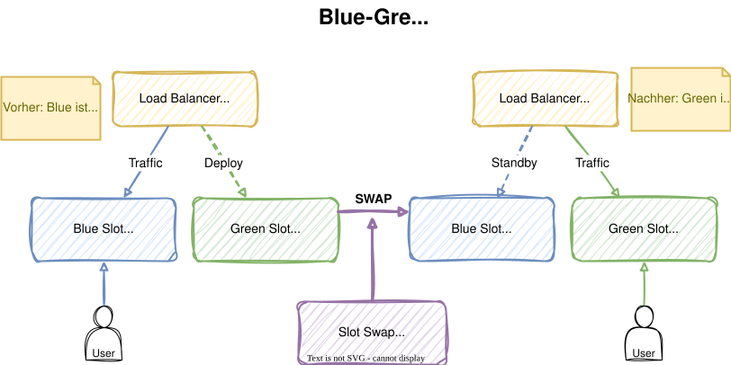
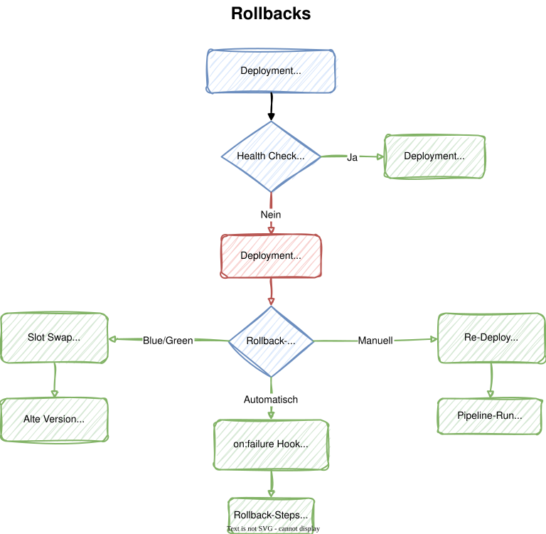

# Modul 07

## Advanced Deployments

---

## Lernziele

Nach diesem Modul kannst du:

- **Blue/Green Deployments mit Deployment Slots umsetzen** - Neue
  Versionen ohne Downtime deployen und Traffic umschalten
- **Rollback-Strategien anwenden** - Bei fehlgeschlagenen Deployments
  schnell auf eine funktionierende Version zurückkehren
- **Lifecycle Hooks in Deployment Jobs nutzen** - Mit `on:failure`,
  `on:success` und weiteren Hooks den Deployment-Prozess steuern

---

<style scoped>
section {
    font-size: 1.6rem;
}
</style>

## 1. Blue/Green Deployment Konzept

Beim **Blue/Green Deployment** laufen zwei identische Umgebungen parallel:

- **Blue** - Die aktuelle Produktionsversion (Live-Traffic)
- **Green** - Die neue Version (Staging, kein Traffic)

**Ablauf:**

1. Neue Version in den **Green-Slot** deployen
2. Tests gegen den Green-Slot ausführen
3. **Slot Swap** - Traffic von Blue auf Green umleiten
4. Bei Problemen: erneut swappen (**Instant Rollback**)

> **Vorteil:** Zero-Downtime Deployment mit sofortigem Rollback-Mechanismus.

---



---

<style scoped>
section {
    font-size: 1.6rem;
}
</style>

## 2. Azure App Service Deployment Slots

Deployment Slots sind **eigenständige Instanzen** innerhalb einer
App Service-Ressource:

- Jeder Slot hat eine **eigene URL** (`<app>-<slot>.azurewebsites.net`)
- Slots teilen sich den **App Service Plan** (gleiche VM)
- Konfiguration kann **slot-spezifisch** sein (Sticky Settings)
- Erfordert mindestens den **Standard (S1)**-Tarif

```bash
# Staging-Slot erstellen
az webapp deployment slot create \
  --name $APP_NAME \
  --resource-group rg-pipeline-training \
  --slot staging
```

---

## 3. Slot-Swap

<style scoped>
section {
    font-size: 1.5rem;
}
</style>

Der Swap-Vorgang ist **nicht einfach ein DNS-Switch**, sondern ein
mehrstufiger Prozess:

| Schritt | Aktion                                          |
|:--------|:------------------------------------------------|
| 1       | Settings des Ziel-Slots auf den Quell-Slot anwenden |
| 2       | Warten, bis alle Instanzen neu starten (**Warm-up**) |
| 3       | Wenn Warm-up OK: Routing-Regeln tauschen        |
| 4       | Quell-Slot erhält Settings des Ziel-Slots       |

- **Sticky Settings** bleiben beim jeweiligen Slot
- Der Swap ist **atomar** - kein Zwischenzustand für Benutzer

> **Ergebnis:** Die alte Version steht sofort im Staging-Slot für einen möglichen Rollback bereit.

---

## 4. Code-Beispiel: Blue/Green Pipeline

<style scoped>
section {
    font-size: 1rem;
}
</style>

```yaml
stages:
  - stage: DeployGreen
    displayName: 'Deploy Green (Staging Slot)'
    jobs:
      - deployment: DeployToSlot
        environment: 'staging'
        strategy:
          runOnce:
            deploy:
              steps:
                - task: AzureWebApp@1
                  inputs:
                    azureSubscription: '$(azureSubscription)'
                    appName: '$(appName)'
                    deployToSlotOrASE: true
                    slotName: 'staging'
                    package: '$(Pipeline.Workspace)/web-app/app.zip'

  - stage: TestGreen
    displayName: 'Smoke Test Green Slot'
    dependsOn: DeployGreen
    jobs:
      - job: ValidateGreen
        pool:
          vmImage: 'ubuntu-latest'
        steps:
          - bash: |
              curl -fsS https://$(appName)-staging.azurewebsites.net/health
            displayName: 'Health Check auf Staging Slot'
```

---

<style scoped>
section {
    font-size: 1.4rem;
}
</style>
```yaml
  - stage: SwapSlots
    displayName: 'Swap Blue/Green'
    dependsOn: TestGreen
    jobs:
      - deployment: SwapToProduction
        environment: 'production'
        strategy:
          runOnce:
            deploy:
              steps:
                - task: AzureCLI@2
                  inputs:
                    azureSubscription: '$(azureSubscription)'
                    scriptType: 'bash'
                    scriptLocation: 'inlineScript'
                    inlineScript: |
                      az webapp deployment slot swap \
                        --name $(appName) \
                        --resource-group rg-pipeline-training \
                        --slot staging \
                        --target-slot production
```

---

<style scoped>
section {
    font-size: 1.2rem;
}
</style>

## 5. Canary Deployments

Beim **Canary Deployment** wird der Traffic schrittweise auf die neue Version umgeleitet:

- **10%** Traffic auf die neue Version (Canary)
- Metriken beobachten (Fehlerrate, Latenz)
- Schrittweise erhöhen: **25%** → **50%** → **100%**
- Bei Problemen: Traffic sofort zurücklenken

**Unterschied zu Blue/Green:**

| Aspekt        | Blue/Green            | Canary                    |
|:--------------|:----------------------|:--------------------------|
| Traffic-Shift | 0% → 100% (sofort)   | Schrittweise (graduell)   |
| Risiko        | Alles oder nichts     | Begrenztes Risiko         |
| Rollback      | Slot Swap             | Traffic auf 0% setzen     |
| Komplexität   | Einfach               | Höher (Monitoring nötig)  |

---

## 6. Traffic-Splitting mit App Service

Azure App Service erlaubt **prozentuale Traffic-Verteilung** zwischen Slots:

```bash
# 20% Traffic an Staging-Slot senden
az webapp traffic-routing set \
  --name $APP_NAME \
  --resource-group rg-pipeline-training \
  --distribution staging=20

# Traffic-Verteilung prüfen
az webapp traffic-routing show \
  --name $APP_NAME \
  --resource-group rg-pipeline-training
```

---

In der Pipeline mit `AzureCLI@2`:

```yaml
- task: AzureCLI@2
  displayName: 'Canary: 10% Traffic'
  inputs:
    scriptType: 'bash'
    inlineScript: |
      az webapp traffic-routing set \
        --name $(appName) \
        --resource-group rg-pipeline-training \
        --distribution staging=10
```

---

## 7. Rollback-Strategien Übersicht

Trotz Tests und Approval Gates kann ein Deployment fehlschlagen.
Drei zentrale Strategien:

| Strategie             | Geschwindigkeit | Automatisierbar | Anwendungsfall       |
|:----------------------|:----------------|:----------------|:---------------------|
| **Slot Swap**         | Sekunden        | Ja              | Blue/Green Setup     |
| **Re-Deploy**         | Minuten         | Ja              | Älteren Run starten  |
| **on:failure Hook**   | Sofort          | Ja              | Pipeline-integriert  |

---



---

## 8. Slot-Swap Rollback

<style scoped>
section {
    font-size: 1.2rem;
}
</style>
Der **schnellste Rollback** bei Blue/Green Deployments:

```bash
# Erneut swappen - alte Version ist noch im Staging-Slot
az webapp deployment slot swap \
  --name $APP_NAME \
  --resource-group rg-pipeline-training \
  --slot staging \
  --target-slot production
```

**Vorteile:**

- Dauert nur **Sekunden**
- Kein neuer Build oder Deploy nötig
- Die alte Version läuft bereits im Staging-Slot (aufgewärmt)

**Einschränkung:**

- Funktioniert nur, wenn der **Staging-Slot nicht
  überschrieben** wurde
- **Sticky Settings** können den Zustand beeinflussen

---

## 9. Redeployment der vorherigen Version

Wenn kein Slot-Swap möglich ist, kann ein **älterer
Pipeline-Run** erneut ausgeführt werden.

Es gibt zwei Varianten:

**Manuell im Portal:**

1. Zu **Pipelines > Runs** navigieren
2. Erfolgreichen Run wählen
3. **"Run new"** - startet neuen Run mit dem gleichen Commit

---

<style scoped>
section {
    font-size: 1.4rem;
}
</style>
**Per Parameter in der Pipeline:**

```yaml
parameters:
  - name: rollbackToBuild
    displayName: 'Rollback auf Build-Nummer'
    type: string
    default: ''

stages:
  - stage: ManualRollback
    condition: ne('${{ parameters.rollbackToBuild }}', '')
    dependsOn: []
    jobs:
      - deployment: RollbackDeployment
        environment: 'dev'
        strategy:
          runOnce:
            deploy:
              steps:
                - script: |
                    echo "Rollback auf Build: \
                      ${{ parameters.rollbackToBuild }}"
```

---

## 10. on:failure Handler in YAML

<style scoped>
section {
    font-size: 1.2rem;
}
</style>

Der `on:failure`-Hook wird **automatisch bei Fehlern** im
Deployment Job ausgeführt:

```yaml
strategy:
  runOnce:
    deploy:
      steps:
        - task: AzureWebApp@1
          inputs:
            appName: '$(appName)'
        - script: |
            # Health Check
            curl -f https://$(appName).azurewebsites.net/health
          displayName: 'Health Check'
    on:
      failure:
        steps:
          - script: |
              echo "Deployment fehlgeschlagen!"
              echo "Rollback wird eingeleitet..."
            displayName: 'Automatischer Rollback'
          - script: |
              echo "Benachrichtige Team..."
            displayName: 'Team benachrichtigen'
```

---

## 11. Lifecycle Hooks


Deployment-Strategien bieten mehrere **Lifecycle Hooks**:

| Hook                  | Zeitpunkt                          | Typischer Einsatz          |
|:----------------------|:-----------------------------------|:---------------------------|
| **preDeploy**         | Vor dem Deployment                 | Backup, Wartungsmodus      |
| **deploy**            | Das eigentliche Deployment         | App deployen               |
| **routeTraffic**      | Nach Deploy, vor Traffic-Switch    | Canary-Traffic konfigurieren |
| **postRouteTraffic**  | Nach Traffic-Switch                | Monitoring, Validierung    |
| **on:success**        | Bei erfolgreichem Deployment       | Bestätigung, Cleanup       |
| **on:failure**        | Bei fehlgeschlagenem Deployment    | Rollback, Benachrichtigung |

---

<style scoped>
section {
    font-size: 1.3rem;
}
</style>
```yaml
strategy:
  runOnce:
    preDeploy:
      steps:
        - script: echo "Bereite Deployment vor..."
    deploy:
      steps:
        - task: AzureWebApp@1
          inputs: { appName: '$(appName)' }
    routeTraffic:
      steps:
        - script: echo "Traffic wird umgeleitet..."
    postRouteTraffic:
      steps:
        - script: echo "Validiere Produktion..."
    on:
      failure:
        steps:
          - script: echo "Rollback!"
      success:
        steps:
          - script: echo "Deployment erfolgreich!"
```

---

## Labs

- **Lab 14:** Blue/Green Deployment
- **Lab 15:** Rollback-Strategien
