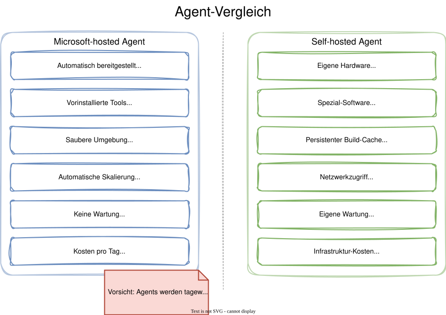
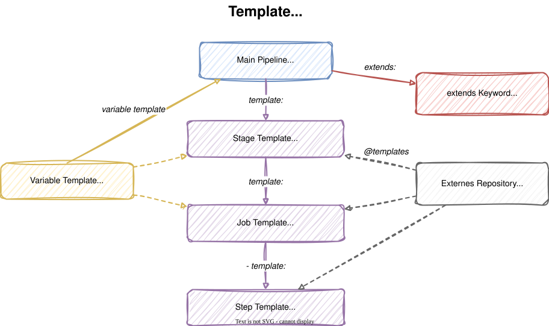
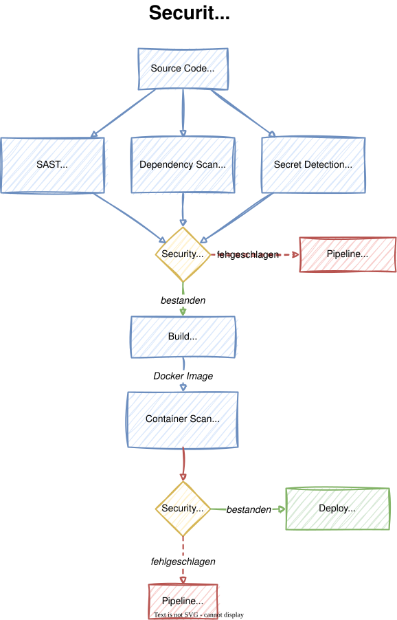

# Modul 09

## Fortgeschrittene Themen

---

## Lernziele

Nach diesem Modul kannst du:

- **Self-hosted Agents einrichten und verwalten** - Einen eigenen
  Build-Agent auf Linux installieren und als systemd-Service betreiben
- **Pipeline-Templates erstellen und wiederverwenden** - Step-, Job-,
  Stage- und Variable-Templates organisationsweit einsetzen
- **Security Scanning in Pipelines integrieren** - SAST, Dependency
  Scanning, Secret Detection und Container Scanning als Quality Gates
  nutzen

---

## 1. Self-hosted Agents: Warum und Wann?

Microsoft-hosted Agents sind bequem, aber manchmal reichen sie nicht:

- **Spezielle Software oder Hardware** - Lizenzierte Tools, GPUs,
  besondere Compiler
- **Netzwerkzugriff** - Zugriff auf On-Premises-Systeme, Datenbanken
  hinter Firewalls, VPN-Verbindungen
- **Build-Performance** - Leistungsstärkere Maschinen, persistenter
  Build-Cache für schnellere Builds
- **Compliance** - Anforderungen an den Build-Ort (z.B. Daten dürfen
  die eigene Infrastruktur nicht verlassen)

---



---

## 1.1 Agent-Installation auf Linux

<style scoped>
section {
    font-size: 1.5rem;
}
</style>

```bash
# Verzeichnis erstellen
mkdir -p ~/azagent && cd ~/azagent

# Agent herunterladen
curl -fkSL -o vsts-agent-linux-x64.tar.gz \
  https://vstsagentpackage.azureedge.net/agent/3.248.0/\
vsts-agent-linux-x64-3.248.0.tar.gz

# Entpacken
tar zxvf vsts-agent-linux-x64.tar.gz

# Konfiguration starten
./config.sh
# Server URL:  https://dev.azure.com/<org>
# Auth:        PAT
# Agent Pool:  linux-training-pool
# Agent Name:  training-agent-01
```

---
<style scoped>
section {
    font-size: 1.5rem;
}
</style>

## 1.2 Agent-Pool-Konfiguration

Ein **Agent Pool** gruppiert Agents für die Zuweisung an Pipelines:

1. **Organization Settings > Agent pools > Add pool**
2. Pool type: **Self-hosted**
3. Name: z.B. `linux-training-pool`
4. **Grant access permission to all pipelines** aktivieren

```yaml
# Pipeline referenziert den Pool per Name
pool:
  name: 'linux-training-pool'
```

> **Tipp:** Verwende separate Pools für verschiedene Zwecke
> (Build, Test, Deploy) oder Umgebungen (Dev, Prod).

---
<style scoped>
section {
    font-size: 1.5rem;
}
</style>

## 1.3 systemd Service für den Agent

Für den Produktionsbetrieb sollte der Agent als **systemd-Service**
laufen:

```bash
# Service installieren und starten
sudo ./svc.sh install
sudo ./svc.sh start

# Status prüfen
sudo ./svc.sh status

# Service stoppen und deinstallieren
sudo ./svc.sh stop
sudo ./svc.sh uninstall
```

- Der Agent startet **automatisch beim Booten**
- Neustart bei Absturz wird durch systemd verwaltet
- Agent-Updates werden automatisch eingespielt

---
<style scoped>
section {
    font-size: 1.5rem;
}
</style>

## 1.4 Capabilities und Demands

Self-hosted Agents melden ihre installierten Tools als
**Capabilities**. Pipelines können **Demands** stellen:

```yaml
pool:
  name: 'linux-training-pool'
  demands:
    - npm
    - docker
    - Agent.OS -equals Linux
```

| Typ                    | Beschreibung                          |
|:-----------------------|:--------------------------------------|
| **System Capabilities**| Automatisch erkannt (OS, Tools)       |
| **User Capabilities**  | Manuell im Portal hinzugefügt        |
| **Demands**            | Pipeline fordert bestimmte Capability |

---

## 2. Pipeline-Templates: Überblick

Templates lösen das **Copy-Paste-Problem** bei ähnlichen Pipelines:

- **Wiederverwendbare** Pipeline-Bausteine
- **Parametrisierbar** für flexible Nutzung
- **Versionierbar** in eigenen Repositories
- **Organisationsweit** einsetzbar

> Ohne Templates: Änderung an 50 Pipelines = 50 manuelle Edits.
> Mit Templates: Änderung am Template = alle Pipelines aktualisiert.

---

## 2.1 Template-Typen

<style scoped>
table { font-size: 0.85rem; }
</style>

| Template-Typ      | Inhalt                 | Einbindung                     |
|:------------------|:-----------------------|:-------------------------------|
| **Step Template** | Wiederverwendbare Steps| `steps: - template: steps/x.yml` |
| **Job Template**  | Wiederverwendbare Jobs | `jobs: - template: jobs/x.yml`   |
| **Stage Template**| Wiederverwendbare Stages| `stages: - template: stages/x.yml`|
| **Variable Template** | Gemeinsame Variablen | `variables: - template: vars/x.yml`|

**Verschachtelung** möglich: Stage Template nutzt Job Template,
das wiederum Step Templates einbindet.

---



---
<style scoped>
section {
    font-size: 1.3rem;
}
</style>

## 2.2 Template-Parameter und Validierung

Templates akzeptieren **typisierte Parameter** mit Validierung:

```yaml
parameters:
  - name: nodeVersion
    type: string
    default: '20.x'
  - name: publishArtifact
    type: boolean
    default: true
  - name: environment
    type: string
    values:      # Erlaubte Werte
      - dev
      - staging
      - production
  - name: environments
    type: object
    default:
      - name: dev
      - name: staging
```

> Pflicht-Parameter ohne `default` müssen beim Aufruf angegeben werden.

---
<style scoped>
section {
    font-size: 1.5rem;
}
</style>

## 2.3 extends Keyword

Das `extends` Keyword **erzwingt** die Nutzung eines Templates --
ideal als **Sicherheits-Gate**:

```yaml
# Pipeline MUSS dieses Template verwenden
extends:
  template: stages/secure-pipeline.yml@templates
  parameters:
    nodeVersion: '20.x'
```

- Die Pipeline kann **nur die vom Template erlaubten Steps** nutzen
- Administratoren können `extends` als
  **Required Template** vorschreiben
- Verhindert, dass Teams unsichere Pipeline-Konfigurationen verwenden

---
<style scoped>
section {
    font-size: 1.5rem;
}
</style>

## 2.4 Externe Repos als Template-Quellen

Templates können aus **anderen Repositories** eingebunden werden:

```yaml
resources:
  repositories:
    - repository: templates
      type: git
      name: pipeline-labs/pipeline-templates
      ref: refs/heads/main    # oder refs/tags/v1.0

stages:
  - template: stages/standard-pipeline.yml@templates
    parameters:
      nodeVersion: '20.x'
```

> **Best Practice:** Verwende Tags (`refs/tags/v1.0`) statt Branches
> für stabile, versionierte Templates.

---
<style scoped>
section {
    font-size: 1.2rem;
}
</style>

## 2.5 Code-Beispiel: Step Template

```yaml
# steps/nodejs-build.yml
parameters:
  - name: nodeVersion
    type: string
    default: '20.x'
  - name: workingDirectory
    type: string
    default: '$(System.DefaultWorkingDirectory)'

steps:
  - task: NodeTool@0
    inputs:
      versionSpec: ${{ parameters.nodeVersion }}
    displayName: 'Node.js installieren'

  - script: npm ci || npm install
    displayName: 'Abhängigkeiten installieren'
    workingDirectory: ${{ parameters.workingDirectory }}

  - script: npm run build --if-present
    displayName: 'Build ausführen'
    workingDirectory: ${{ parameters.workingDirectory }}
```

---
<style scoped>
section {
    font-size: 1.2rem;
}
</style>

## 2.6 Code-Beispiel: Stage Template

```yaml
# stages/standard-pipeline.yml
parameters:
  - name: nodeVersion
    type: string
    default: '20.x'
  - name: runTests
    type: boolean
    default: true

stages:
  - stage: Build
    jobs:
      - template: ../jobs/build-job.yml
        parameters:
          nodeVersion: ${{ parameters.nodeVersion }}

  - ${{ if parameters.runTests }}:
    - stage: Test
      dependsOn: Build
      jobs:
        - job: RunTests
          pool:
            vmImage: 'ubuntu-latest'
          steps:
            - template: ../steps/nodejs-build.yml
            - template: ../steps/run-tests.yml
```

---
<style scoped>
section {
    font-size: 1.5rem;
}
</style>

## 3. Security Scanning: Überblick

**Shift Left Security** - Sicherheit früh in der Pipeline
integrieren, nicht erst am Ende:

| Scan-Typ              | Prüft                        | Tools                       |
|:----------------------|:------------------------------|:----------------------------|
| **SAST**              | Quellcode auf Schwachstellen  | SonarQube, Semgrep, Checkmarx|
| **SCA / Dependency**  | Abhängigkeiten auf CVEs      | Snyk, npm audit, OWASP      |
| **Secret Detection**  | Eingecheckte Credentials      | GitLeaks, TruffleHog         |
| **Container Scanning**| Docker-Images auf Schwachstellen| Trivy, Aqua Security       |

---



---

## 3.1 SAST mit SonarQube / Semgrep

<style scoped>
section {
    font-size: 1.5rem;
}
</style>

**Static Application Security Testing** analysiert den Quellcode:

- **SQL Injection** - String-Konkatenation in Queries
- **Command Injection** - Unvalidierte Eingaben in `exec`/`spawn`
- **XSS** - Nicht-escaped Benutzereingaben in HTML
- **Path Traversal** - Unvalidierte Dateipfade

```yaml
# SonarQube-Integration in Azure Pipelines
- task: SonarQubePrepare@5
  inputs:
    SonarQube: 'sonarqube-connection'
    projectKey: 'my-project'
- script: npm run build
- task: SonarQubeAnalyze@5
- task: SonarQubePublish@5
```

---
<style scoped>
section {
    font-size: 1.5rem;
}
</style>

## 3.2 Dependency Scanning

Prüft alle Abhängigkeiten auf **bekannte Schwachstellen** (CVEs):

```yaml
# npm audit in der Pipeline
- script: |
    npm audit --audit-level=moderate
  displayName: 'Dependency Check'
  continueOnError: true
```

**Professionelle Tools:**

- **Snyk** - `SnykSecurityScan@1` Task (Marketplace Extension)
- **OWASP Dependency Check** - umfassender Scanner
- **npm audit** - eingebaut, gut für schnelle Checks

> **Tipp:** Konfiguriere `npm audit` als Quality Gate -- bei
> kritischen CVEs wird die Pipeline blockiert.

---
<style scoped>
section {
    font-size: 1.5rem;
}
</style>

## 3.3 Container Image Scanning

Nach dem Build: Docker-Image auf Schwachstellen prüfen:

```yaml
- script: |
    # Trivy installieren
    curl -sfL https://raw.githubusercontent.com/aquasecurity/\
trivy/main/contrib/install.sh | sh -s -- -b /usr/local/bin

    # Image scannen
    trivy image --severity HIGH,CRITICAL \
      --exit-code 1 \
      myapp:$(Build.BuildId)
  displayName: 'Container Security Scan'
```

- **Trivy** scannt OS-Pakete und Anwendungs-Abhängigkeiten
- `--exit-code 1` lässt die Pipeline bei Findings fehlschlagen
- Auch in **Azure Container Registry** als automatischer Scan möglich

---
<style scoped>
section {
    font-size: 1.2rem;
}
</style>

## 3.4 Secret Detection

Erkennt versehentlich eingecheckte Credentials:

```yaml
- script: |
    # GitLeaks installieren
    curl -sSfL \
      https://github.com/gitleaks/gitleaks/releases/download/\
v8.18.0/gitleaks_8.18.0_linux_x64.tar.gz \
      | tar xz -C /usr/local/bin

    # Repository scannen
    gitleaks detect --source . --verbose
  displayName: 'Secret Detection'
```

**Häufige Findings:**

- Hardcoded Passwörter und API-Keys
- AWS Access Keys (`AKIA...`)
- Private Keys und Zertifikate

> **Lösung:** Azure Key Vault, Pipeline-Variablen (secret), `.env`-Dateien in `.gitignore`

---

## 3.5 Security Scanning als Quality Gate

<style scoped>
section {
    font-size: 1.3rem;
}
</style>

In der Praxis: Security Scans als **verbindliche Checks**:

```yaml
stages:
  - stage: SecurityScan
    jobs:
      - job: SAST
        # ...
      - job: DependencyCheck
        # ...
      - job: SecretScan
        # ...

  - stage: Build
    dependsOn: SecurityScan
    condition: succeeded()   # Nur bei bestandenen Scans
```

- **PR-Checks:** Security Scan als Required Check für Pull Requests
- **Branch Policies:** Merge nur bei bestandenem Security Scan
- **Microsoft Defender for DevOps:** `MicrosoftSecurityDevOps@1` Task

---

## Labs

- **Lab 19:** Self-hosted Agent auf Linux einrichten
- **Lab 20:** Pipeline-Templates und Wiederverwendung
- **Lab 21:** Security Scanning (SAST, Dependency Checks)
